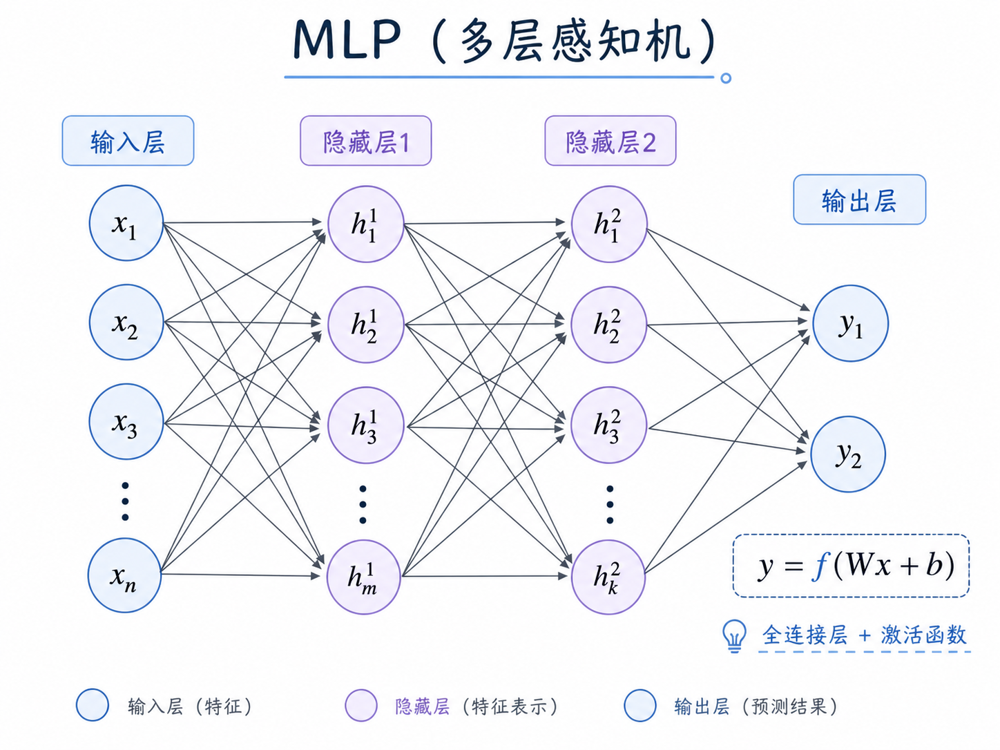
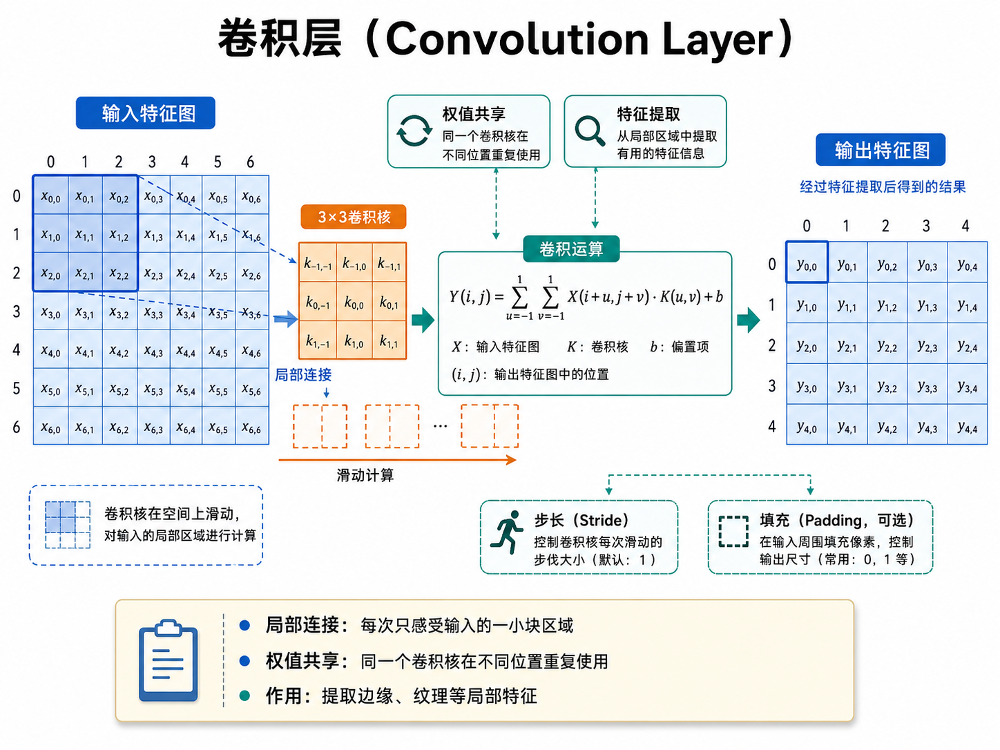

### MLP反向传播梯度推导

------

设MLP输入为向量 $x_0$ ，一共有 $n$ 层，第i层的参数矩阵为 $W_i$ ，损失函数为 $Loss$ ，第i层的激活函数为 $f_i(·)$

数据在MLP中的传递过程：

$$
z_i=W_ia_{i-1}+b_i
$$

$$
a_i=f_i(z_i)
$$

第 $i$ 层的梯度为：

$$
\frac{\partial Loss}{\partial W_i} =\frac{\partial Loss}{\partial z_i} \frac{\partial z_i}{\partial W_i} =\frac{\partial Loss}{\partial z_i} a_{i-1}^T
$$

我们定义误差项：

$$
\delta _i=\frac{\partial Loss}{\partial z_i} 
$$

那么：

$$
\frac{\partial Loss}{\partial W_i}=\delta_ia_{i-1}^T
$$

其中，有：

$$
\delta_n=\frac{\partial Loss}{\partial z_n}=\frac{\partial Loss}{\partial a_n}\odot f_n'(z_n)
$$

$$
\delta_{n-1}=\frac{\partial Loss}{\partial z_{n-1}}=\frac{\partial Loss}{\partial z_n}\frac{\partial z_n}{\partial a_{n-1}}\odot f_{n-1}'(z_{n-1})=W_n^T\delta_n\odot f'_{n-1}(z_{n-1})
$$

我们得到了误差项的递推公式后发现，第 $n-1$ 层的误差项依赖第 $n$ 层的误差项计算得到，说明梯度的计算是从输出层向输入层反向传播得到的。

知道了第 $i$ 层的梯度后，我们就可以根据参数矩阵的更新公式（$\alpha$ 为学习率）：

$$
W_{i}'=W_{old}+\Delta W=W_{i}+\alpha \frac{\partial Loss}{\partial W_i}
$$

来更新每一层的参数。

偏置梯度推导：

$$
\frac{\partial Loss}{\partial b_i}=\frac{\partial Loss}{\partial z_i}\frac{\partial z_i}{\partial b_i}=\delta_i
$$

### 卷积层反向传播梯度推导

------

设卷积层的输入特征（经过填充后）为 $X \in R^{B \times C_{in} \times H_{in} \times W_{in}}$ ，输出特征为 $Z \in R^{B \times C_{out} \times H_{out} \times W_{out}}$，对应于第 $o \in [0,C_{out}-1]$ 个输出通道，第 $c \in [0, C_{in} - 1]$ 个输入通道，位置 $u \in [0, K_h-1],v \in [0, K_w-1]$ 的卷积核参数为 $W_{o,c,u,v}$ ，那么前向传播过程可以表示为：

$$
Z_{n,o,i,j}=\sum_{c=0}^{C_{in}-1} \sum_{u=0}^{K_h-1}\sum_{v=0}^{K_w-1}W_{o,c,u,v}X_{n,c,is+u,js+v}+b_o
$$

$$
A_{n,o,i,j}=f(Z_{n,o,i,j})
$$

其中，$s$ 表示卷积步长，$i \in [0, H_{out}-1],j \in [0,W_{out}-1]$ 表示输出特征上的位置，$n \in [0, B-1]$ 表示第 $n$ 个batch，$f(·)$ 表示激活函数。

卷积核参数梯度为：

$$
\frac{\partial Loss}{\partial W_{o,c,u,v}}=\sum_{n} \sum_{i} \sum_{j}\frac{\partial Loss}{\partial Z_{n,o,i,j}}\frac{\partial Z_{n,o,i,j}}{\partial W_{o,c,u,v}}
$$

我们可以定义误差项：

$$
\delta_{n,o,i,j}=\frac{\partial Loss}{\partial Z_{n,o,i,j}}=\frac{\partial Loss}{\partial A_{n,o,i,j}}\odot f'(Z_{n,o,i,j})
$$

又因为：

$$
Z_{n,o,i,j}=\sum_{c'}\sum_{u'}\sum_{v'}W_{o,c',u',v'}X_{n,c',is+u',js+v'}+b_o
$$

只有当$u'=u,v'=v,c'=c$ 时，$\frac{\partial (W_{o,c',u',v'}X_{n,c',is+u',js+v'})}{\partial W_{o,c,u,v}}$ 才不为零，等于 $X_{n,c,is+u,js+v}$ 。

所以，有：

$$
\frac{\partial Loss}{\partial W_{o,c,u,v}}= \sum_{n}\sum_{i}\sum_{j}\delta_{n,o,i,j}X_{n,c,is+u,js+v}
$$

偏置的梯度推导：

$$
\frac{\partial Loss}{\partial b_o}=\sum_{n}\sum_{i}\sum_{j}\delta_{n,o,i,j}
$$
